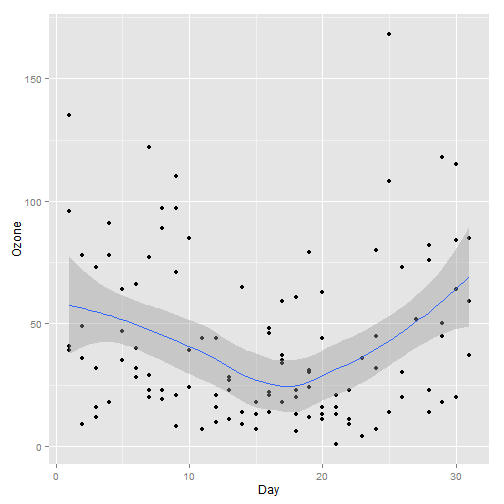

ShinyApp
========================================================
author: Priyanka Saboo
transition: fade

Airquality Analysis
========================================================

* The shiny app presents the data from New York Air Quality Measurements. the data is the daily air quality measurements in New York from May to September 1973.
* The app takes 2 inputs from the user and plots the graph and its mean accordingly 
      - X axis 
      - Y axis

Data
========================================================

Daily readings of the following air quality values for May 1, 1973 (a Tuesday) to September 30, 1973.

* Ozone: Mean ozone in parts per billion from 1300 to 1500 hours at Roosevelt Island

* Solar.R: Solar radiation in Langleys in the frequency band 4000-7700 Angstroms from 0800 to 1200 hours at Central Park

* Wind: Average wind speed in miles per hour at 0700 and 1000 hours at LaGuardia Airport

* Temp: Maximum daily temperature in degrees Fahrenheit at La Guardia Airport.

Code Snippet
========================================================
UI.R

```r
library(shiny)
shinyUI(
  pageWithSidebar(
  headerPanel("Air Quality"),
  sidebarPanel(
    selectInput('xcol', 'X Variable', names(airquality)[5:6], selected=names(airquality)[[5]]),
    selectInput('ycol', 'Y Variable', names(airquality)[1:4], selected=names(airquality)[[1]])
  ),
  mainPanel(
    plotOutput('plot1')
  )
)))
```

Example Plot
========================================================


```r
library(ggplot2)
qplot(x=airquality$Day, y=airquality$Ozone, xlab="Day", ylab="Ozone")+geom_point(shape=1) + geom_smooth()
```

 
